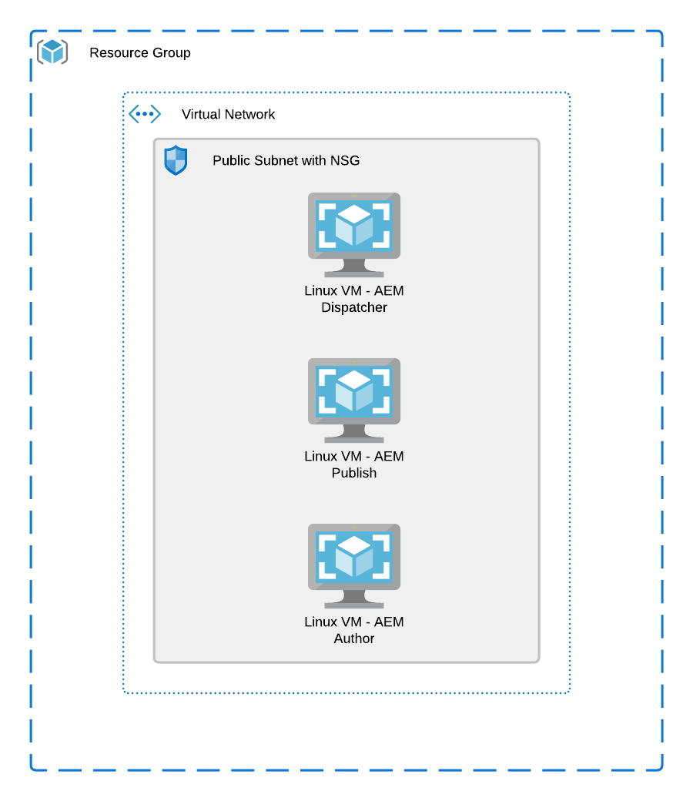

# terraform-azure-aem

Terraform module to create/provision AEM on Azure

## System overview

This Terraform module will provision below infrastructure to run AEM on Azure:


- A resource group to hold all resources.
- A virtual network.
- A public subnet with NSG (Network Security Group).
- A VM (with all its dependencies) as Author role.
- A VM (with all its dependencies) as Publish role.
- A VM (with all its dependencies) as Dispatcher role.

## Requirements

- Setup and configure Azure CLI: https://docs.microsoft.com/en-us/cli/azure/install-azure-cli
- Setup Terraform CLI: https://learn.hashicorp.com/tutorials/terraform/install-cli
- You will need the jar file of AEM and a valid license file. Make sure you update init scripts in ```scripts``` with a
  valid download link for AEM jar file and license file.

## Usage

To run this example you need to execute:

```bash
$ terraform init
$ terraform plan
$ terraform apply
```

Note that this example may create resources which can cost money. Run `terraform destroy` when you don't need these
resources.

## Inputs

- Location (default Southeast Asia - Singapore)
- Resouce group name (default aem-wknd-demo)
- Your SSH Public Key value

## Outputs

- Public IP Addresses of created instances.